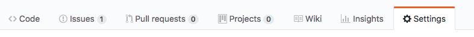

# VuePress 快速上手指南

前段时间，尤雨溪发布了一款基于 Vue 的静态网站生成器 [VuePress](https://vuepress.vuejs.org) ，可谓火极一时。其为编写技术文档而优化的默认主题也让人非常喜爱，遂决定将 [MP-WeUI](https://youngluo.github.io/mp-weui) 的文档重新使用 VuePress 生成。

## 安装预览

安装 VuePress
``` bash
npm install -D vuepress
```

在项目根目录下创建 docs 文件夹，用于存放文档 md 源文件，并在 docs 文件夹根目录下创建 `readme.md` 文件，用于配置文档首页信息，[查看详情](https://vuepress.vuejs.org/default-theme-config/#homepage)

``` yaml
---
home: true
actionText: 开始 →
actionLink: /components/agree
footer: MIT Licensed | Copyright © 2018 独孤求败
---
```

配置 package.json

``` json
{
  "scripts": {
    "docs:dev": "npx vuepress dev docs",
    "docs:build": "npx vuepress build docs"
  }
}
```

预览

``` bash
npm run docs:dev
```

## 自定义配置

在 docs 文件夹下创建 .vuepress 文件夹，通过必要的 `.vuepress/config.js` 对网站进行配置

``` js
module.exports = {

  // 如果你计划发布的站点是在某个仓库下，比如 https://github.com/youngluo/mp-weui ，则 base 需要指定为 /mp-weui/
  base: '/mp-weui/',

  // 站点标题，在默认主题中会显示在导航栏左侧
  title: 'MP-WeUI',

  // 站点描述，将会在 HTML 中渲染为 <meta> 标签，在默认主题中会显示在首页上
  description: '基于 mpvue 和 weui-wxss 的微信小程序 UI 库',

  // 在 <head> 标签中自定义额外标签
  head: [
    ['meta', { name: 'keywords', content: 'mpvue,weui,mp-weui' }],
    ['link', { rel: 'icon', href: `/favicon.png` }]
  ],

  serviceWorker: true,

  // 配置 google 分析统计
  ga: '',

  themeConfig: {
    repo: 'youngluo/mp-weui',

    docsDir: 'docs',

    // 禁止提取 h2, h3 标签链接到侧边栏中
    sidebarDepth: 0,

    nav: [
      { text: '组件', link: '/components/agree' }
    ],

    sidebar: {
      '/components/': genSidebarConfig()
    }
  }
}
```

如果需要在站点中提供一些静态资源，比如 favicons 或者 PWA icons，你可以将它们放在 `.vuepress/public` 下，它们将会被复制到生成文件夹的根目录下

## 打包

执行命令

``` bash
npm run docs:build
```

打包文件默认会输出到 `.vuepress/dist`

## 发布到 GitHub

创建 deploy.sh

``` bash
#!/usr/bin/env sh

set -e

npm run docs:build

cd docs/.vuepress/dist

# if you are deploying to a custom domain
# echo 'www.example.com' > CNAME

git init
git add -A
git commit -m 'update docs'

git push -f git@github.com:youngluo/mp-weui.git master:gh-pages

cd -
```

配置 package.json

``` json
{
  "scripts": {
    "deploy": "bash deploy.sh",
  }
}
```

最后执行 `npm run deploy` 将打包后的文件推送到 github gh-pages 分支

## GitHub Pages 配置

在 github 仓库中点击 Settings 选项卡



将页面滚动到 GitHub Pages，将 `Source` 选择为 `gh-pages branch`


大功告成！[预览示例](https://youngluo.github.io/mp-weui)


